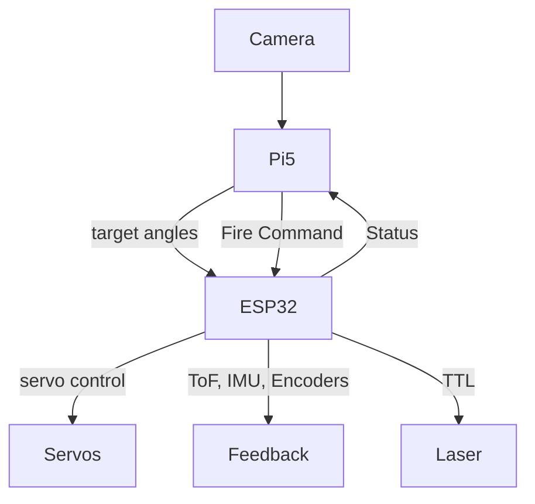

# Mosquito-Laser-Defence-Turret
A smart, vision-guided mosquito elimination system that uses computer vision and embedded real-time control to detect, track, and neutralize flying mosquitoes with a laser.
## 🎯 Project Goals

- Detect and classify mosquitoes in real-time using AI
- Track their motion using optical flow and Kalman prediction
- Aim a laser turret at the target using servo PID control
- Use sensor fusion (IMU, encoders, ToF) for precise alignment
- Safely fire a laser pulse to eliminate the mosquito

---

## 🧠 System Overview

This system is split into two main processing layers:

### 🧠 Raspberry Pi 5 (High-Level Vision & AI)
- Global shutter camera input
- Object detection (AI HAT+ 13 TOPS)
- Optical flow + Kalman filtering
- Sends turret pose targets via micro-ROS
- Confirms alignment and issues fire commands

### ⚙️ ESP32 (Real-Time Control)
- Runs FreeRTOS + micro-ROS
- PID control for pan/tilt servos using encoder + IMU
- Laser TTL control
- Reads ToF distance + publishes turret status and sensor data

---

## 🛠️ Hardware Bill of Materials (BOM)

| Category        | Component                                       | Quantity | Notes |
|----------------|--------------------------------------------------|----------|-------|
| 🔲 MCU          | ESP32 Dev Kit (ESP32-S3 recommended)            | 1        | For real-time control and micro-ROS |
| 💻 Main SBC     | Raspberry Pi 5 (8 GB)                           | 1        | Runs ROS 2 + vision/AI code |
| 🤖 AI Coprocessor | Raspberry Pi AI Kit+ (Hailo 8L, 13 TOPS)      | 1        | Inference acceleration |
| 🎥 Camera       | Pi Global Shutter Camera (IMX296)               | 1        | High-speed motion clarity |
| 🔍 Lens         | CS-Mount 6 mm 3MP Lens (e.g. PT361060M3MP12)    | 1        | Suited for 1–1.5 m detection range |
| 💡 IR Lighting  | IR LED ring (CS-mount-compatible) + IR filter   | 1        | Optional for night detection |
| 🎯 Laser Diode  | OSRAM PLPT5 447KA (445 nm, 1.6 W)               | 1        | High-power TTL-controlled diode |
| ⚡ Laser Driver | TTL-controlled constant-current driver (1.6 A)  | 1        | Will be upgraded later |
| 🎚️ Servos       | High-torque digital servos (MG996R or better)   | 2        | Pan & tilt |
| 📐 Encoders     | AS5600 magnetic encoder module                  | 2        | Pan/tilt joint position feedback |
| 📦 IMU          | MPU6050 or similar (gyro + accelerometer)       | 1        | Motion smoothing |
| 📏 ToF Sensor   | VL53L0X or VL53L1X                              | 1        | Range verification |
| 🎙️ Mic (optional) | Electret mic + MAX9814 module                | 1        | Optional wingbeat FFT trigger |
| 🧰 Misc         | Jumper wires, breadboard or PCB, screws, mounts| –        | For assembly |
| 🔋 Power        | 12 V 3A power supply with Buck converter for servos and laser     | 1        | Dedicated supply recommended |

---

## 🧩 Software Components

- `ROS 2 Humble` on Pi 5
- `micro-ROS` on ESP32 (FreeRTOS)
- `OpenCV` for optical flow (Pi 5)
- AI model (YOLOv5 nano / MobileNet SSD)
- PID implementation in C (ESP32)
- Kalman filter in Python or C++

---

## 📐 System Flow Summary

---

## 🧪 Development Milestones

- [x] System architecture finalized
- [ ] Parts ordered
- [ ] Servo + PID loop test
- [ ] micro-ROS communication test
- [ ] Object detection prototype
- [ ] Optical flow tracking
- [ ] Target alignment + firing logic
- [ ] Safety & calibration procedures

---

## ⚠️ Safety Disclaimer

> This project uses a Class 3B/4 laser.  
> Always wear **proper eye protection** and test in a controlled environment.  
> Implement all necessary **laser interlocks** and software safety checks.

---

## 📝 License

MIT License 

---

## 💬 Credits

Developed by Mohamad Nassif as a fusion of computer vision, real-time embedded control, and robotics — with a practical use case: eliminating mosquitoes with science and precision.

    
